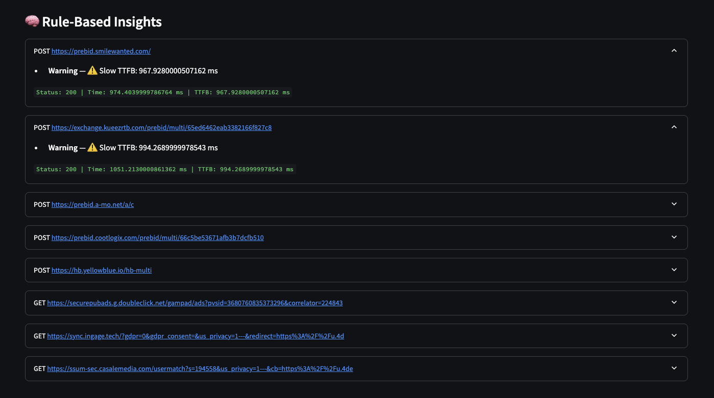

# HAR File Analyzer 🧪

An interactive Streamlit app that analyzes HAR files to identify performance issues using rule-based logic, visual charts, and AI-powered summaries (OpenAI). Designed to help support engineers and dev teams debug slow or broken web interactions quickly.

---

## 🔧 Features

✅ Upload and parse `.har` files  
✅ View top N slowest requests (bar chart)  
✅ See status code breakdown (pie chart)  
✅ Filter by status, MIME type, or slow TTFB  
✅ View detailed rule-based diagnostics per request  
✅ Get concise AI-generated summaries (optional GPT integration)

---

## 📸 Screenshots

*Uploading a HAR file and displaying charts*

*Viewing rule-based insights*

*Viewing AI-powered summary*
## 🚀 Version History
### v1.2 (May 15, 2025)
- Introduced rule-based insights with:
  - Contextual suggestions (e.g., what a slow TTFB means)
  - Salesforce-specific interpretations for each issue
  - Guided next steps to help with triage
- Added stacked bar chart for slow requests (breaks down DNS, SSL, TTFB, etc.)
- Introduced domain-level load time chart (Top Domains by Total Load Time)
- Improved filter UI using collapsible layout in the main body
- Optional OpenAI-powered summaries (disabled by default)
- Created `mock_all_rules_domains.har` to validate all rule conditions

### v1.3 (May 20, 2025)
- Added header sanitization to redact sensitive values (e.g., Authorization, Cookies)
- Inserted a visible security disclaimer in the UI
- Updated internal documentation to clarify safe usage of customer HAR files

---

